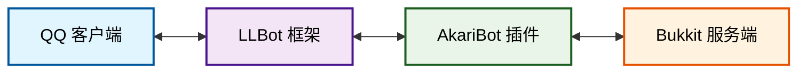

# 快速上手

欢迎使用 AkariBot！本篇教程将帮助你进行插件初始化配置。

## 环境要求

使用插件前，请确保你的服务器已经安装了 [QQ 客户端](https://im.qq.com/index/)
和 [LLBot](https://github.com/LLOneBot/LuckyLilliaBot/releases/latest) 等支持 OneBot 11 协议的 QQ 机器人框架。

## 工作原理



## 插件下载

| 构建版本                                                                                                                                                    | 发行时间                                                                                                                                                   | 发行者                                                                                                                                                        |
|---------------------------------------------------------------------------------------------------------------------------------------------------------|--------------------------------------------------------------------------------------------------------------------------------------------------------|------------------------------------------------------------------------------------------------------------------------------------------------------------|
|  |  |  | 

- **GitHub**：[https://github.com/CPJiNan/AkariBot/releases](https://github.com/CPJiNan/AkariBot/releases)
- **QQ 群**：[704109949](https://qm.qq.com/q/91DcdBuRvW)

## 全局设置

你可以在 `plugins/AkariBot/settings.yml` 文件中修改语言、数据存储方式等设置。

``` yaml
# 全局设置
Options:
  # 语言
  Language: "zh_CN"
  # 配置文件版本
  Config-Version: 1
  # 检查版本更新
  Check-Update: true
  # OP 版本更新通知
  OP-Notify: true
  # 启用 bStats 统计
  Send-Metrics: true
  # 启用调试模式
  Debug: false

# 数据库设置
Database:
  # 存储方式 (MYSQL, SQLITE)
  Type: SQLITE
  # MySQL 存储设置
  MYSQL:
    host: localhost
    port: 3306
    user: root
    password: password
    database: minecraft
  # SQLite 存储设置
  SQLITE:
    file: sqlite.db

# Bot 设置
Bot:
  # HTTP API 服务器地址
  API: "http://127.0.0.1:3000/"
  # HTTP 上报服务器端口
  Post: 8080
```

## 下一步

- [插件命令](/docs/basic/command)